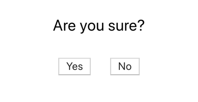
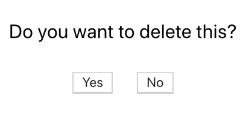

# Exercise 4 - Debugging & Coverage

GitHub URL: [https://github.com/t4d-classes/react-redux-unit-testing_01272020](https://github.com/t4d-classes/react-redux-unit-testing_01272020)

## Steps

1. Using test driven development and snapshot testing, create a component named Confirm Dialog which displays the following. The first screenshot is a default message and the second screenshot is a customized message. Please do not use default props or parameter initialization in your implementation. Also, please do not use the ternary operator. The functions for the Yes and No buttons will be passed into the component.

2. Utilize the Confirm Dialog component in the App Component. When the Yes button is clicked, output the value 'yes' to the console. When the No button is clicked, output the value 'no' to the console. 

3. Run code coverage to ensure all Confirm Dialog paths are tested.

4. Debug the component, placing a break somewhere in the component. Add a watch. Review the variables and the call stack, etc...
